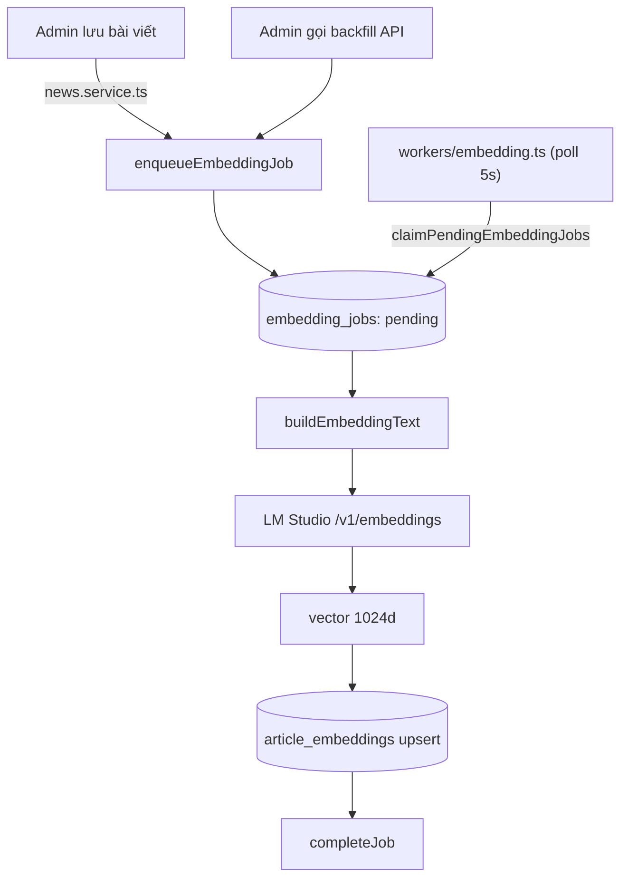

# Phase 8.1 — Embedding Foundation

Xây dựng nền tảng AI: tạo embedding cho toàn bộ bài viết đã publish, lưu vào Supabase pgvector, tự động queue job khi bài viết được tạo/cập nhật.

---

## Mục tiêu

- Kích hoạt `pgvector` trong Supabase
- Tạo bảng `article_embeddings` lưu vector 1024 chiều
- Tạo job queue `embedding_jobs` để background worker xử lý
- Tạo `lmstudio.provider.ts` — adapter cho LM Studio API
- Tạo embedding background worker (poll + process)
- API backfill để queue toàn bộ bài viết cũ
- Tự động queue khi tạo/cập nhật bài viết

---

## Flow



---

## Embedding Text Format

Mỗi bài viết được chuyển thành text trước khi embed:

```
Title: <tiêu đề>
Summary: <tóm tắt>
Content: <nội dung, tối đa 2000 ký tự, HTML stripped>
Source: <nguồn>
Category: <tên danh mục>
```

---

## Database

### `article_embeddings`

| Column | Type | Mô tả |
|--------|------|-------|
| `id` | uuid PK | |
| `article_id` | uuid FK → news | Unique — 1 embedding / bài |
| `embedding` | vector(1024) | BGE-M3 embedding |
| `embedding_text` | text | Text đã dùng để embed (debug) |
| `embedding_model` | text | Tên model (e.g. `gpustack/bge-m3-GGUF`) |
| `created_at` | timestamptz | |
| `updated_at` | timestamptz | |

**Index:** HNSW (`hnsw (embedding vector_cosine_ops)`) — thay thế IVFFlat sau migration `20260619110000`.

### `embedding_jobs`

| Column | Type | Mô tả |
|--------|------|-------|
| `id` | uuid PK | |
| `article_id` | uuid FK → news | |
| `status` | text | `pending` / `processing` / `completed` / `failed` |
| `attempt_count` | int | |
| `last_error` | text | |
| `created_at` | timestamptz | |
| `started_at` | timestamptz | |
| `finished_at` | timestamptz | |

**RPC:** `claim_pending_embedding_jobs(batch_size)` — `FOR UPDATE SKIP LOCKED`, trả về batch jobs và set `status = 'processing'`.

### `match_article_embeddings` RPC

```sql
match_article_embeddings(
  query_embedding  vector(1024),
  match_count      int    DEFAULT NULL,    -- NULL = no hard limit
  min_similarity   float  DEFAULT 0.0
)
RETURNS TABLE (article_id uuid, similarity float)
```

Dùng cosine distance (`1 - (embedding <=> query_embedding)`). Trả về các bài có `similarity >= min_similarity`, sort DESC.

---

## Migrations (theo thứ tự)

| File | Nội dung |
|------|----------|
| `20260618000001_enable_pgvector.sql` | `CREATE EXTENSION IF NOT EXISTS vector` |
| `20260618000002_article_embeddings.sql` | Bảng `article_embeddings` + `match_article_embeddings` RPC (dim=768 ban đầu) |
| `20260618000003_embedding_jobs.sql` | Bảng `embedding_jobs` + `claim_pending_embedding_jobs` RPC |
| `20260619000001_update_match_article_embeddings_min_similarity.sql` | Thêm param `min_similarity` vào RPC |
| `20260619100000_resize_embedding_vector_1024.sql` | Resize `embedding vector(768)` → `vector(1024)` sau khi xác nhận BGE-M3 dim=1024 |
| `20260619110000_fix_embedding_index_ivfflat_to_hnsw.sql` | Đổi index từ IVFFlat → HNSW |

---

## Files tạo mới

```
server/services/ai/
  lmstudio.provider.ts            ← embed(text) + chat(messages) — OpenAI-compatible

server/services/
  embedding.service.ts            ← buildEmbeddingText(article), generateAndSaveEmbedding()

server/repositories/
  article-embedding.repository.ts ← upsertEmbedding(), findEmbeddingByArticleId()
  embedding-job.repository.ts     ← enqueueEmbeddingJob(), claimPendingEmbeddingJobs(),
                                     completeJob(), failJob()

lib/background/embedding/
  service.ts                      ← processPendingEmbeddingJobs(client, batchSize)

workers/
  embedding.ts                    ← Poll loop, SIGINT/SIGTERM shutdown

server/api/admin/embeddings/
  backfill.post.ts                ← POST /api/admin/embeddings/backfill — auth required

scripts/
  probe-embedding-dim.ts          ← Gọi LM Studio, in ra vector dimension
```

**Files sửa đổi:**
- `server/services/news.service.ts` — sau `insertNews`/`updateNews` thành công → `enqueueEmbeddingJob()`
- `workers/all.ts` — đăng ký embedding worker vào concurrent loop
- `app/types/database.types.ts` — thêm types cho `article_embeddings`, `embedding_jobs`

---

## API

### `POST /api/admin/embeddings/backfill`

Yêu cầu auth admin. Tìm tất cả bài `published` chưa có embedding job `pending`/`processing`/`completed`, bulk-insert pending jobs.

**Response 202:**
```json
{ "data": { "enqueued": 42 } }
```

---

## Worker (`workers/embedding.ts`)

```
npm run worker:embedding
```

- Poll `embedding_jobs` mỗi `EMBEDDING_WORKER_POLL_MS` ms (default: 5000)
- Batch size: `EMBEDDING_WORKER_BATCH_SIZE` (default: 5)
- Dừng sạch với SIGINT/SIGTERM
- Log mỗi job processed

---

## RLS

| Table | Policy |
|-------|--------|
| `article_embeddings` | `service_role`: full access; public: no access |
| `embedding_jobs` | `service_role`: full access; public: no access |
