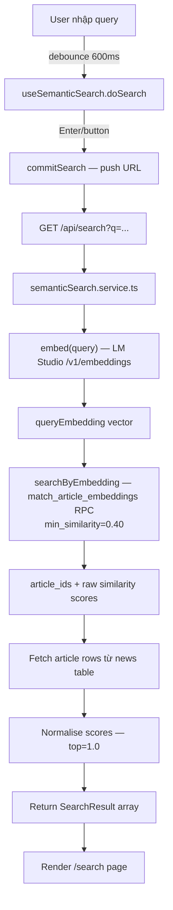

# Phase 8.2 — Semantic Search

Tìm kiếm bài viết bằng ngôn ngữ tự nhiên. Query được embed thành vector, so sánh cosine similarity với toàn bộ bài `published` trong pgvector.

---

## Mục tiêu

- `GET /api/search?q=...&category=...` — semantic search với optional category filter
- Hiển thị kết quả có score bình thường hoá
- Debug mode (`?debug=1`) cho thấy raw/normalised score
- Debounce search input
- Sync URL khi Enter/click — không sync từng keystroke
- Loading / empty / error states (bao gồm 503)

---

## Flow



---

## API

### `GET /api/search`

| Param | Type | Bắt buộc | Mô tả |
|-------|------|----------|-------|
| `q` | string | ✅ | Search query (min 1 char) |
| `category` | string | ❌ | Category slug để filter |

**Response 200:**
```json
{
  "data": [
    {
      "id": "uuid",
      "title": "Tên bài viết",
      "slug": "ten-bai-viet",
      "summary": "...",
      "thumbnailUrl": "...",
      "category": { "name": "Công nghệ", "slug": "cong-nghe" },
      "publishedAt": "2026-06-19T...",
      "viewCount": 123,
      "score": 1.0,
      "rawScore": 0.87
    }
  ]
}
```

**Response 503** (khi LM Studio offline):
```json
{ "error": "AI_UNAVAILABLE", "message": "Semantic search is temporarily unavailable..." }
```

---

## Search Tuning

Tham số cấu hình trong `semantic-search.service.ts`:

| Param | Default | Mô tả |
|-------|---------|-------|
| `MIN_SIMILARITY` | `0.40` | Ngưỡng cosine similarity tối thiểu — filter ở SQL level |
| `MAX_RESULTS` | `10` | Số kết quả trả về tối đa sau khi filter |

Tăng `MIN_SIMILARITY` → kết quả chặt hơn. Giảm → nhiều kết quả hơn nhưng ít liên quan hơn.

---

## Score Normalisation

Kết quả từ pgvector có raw cosine similarity `[0, 1]`. Service normalise để top result = 1.0:

```
score = (rawScore - min) / (max - min)   // nếu max > min
score = 1.0                               // nếu chỉ 1 kết quả
```

`rawScore` vẫn được giữ lại trong response để debug.

---

## Debug Mode

Thêm `?debug=1` vào URL search để hiển thị:
- Raw cosine similarity score
- Normalised score
- Score bar visualization

---

## Files

```
server/api/
  search.get.ts                       ← GET /api/search — validate params, call service

server/services/
  semantic-search.service.ts          ← semanticSearch(event, query, categorySlug)

server/repositories/
  search.repository.ts                ← searchByEmbedding(client, embedding, minSimilarity)

app/pages/
  search.vue                          ← /search page — SSR initial load + client search

app/composables/search/
  useSemanticSearch.ts                ← query ref, debounce, doSearch(), commitSearch()

app/types/
  search.ts                           ← SearchResult DTO
```

---

## Composable Pattern

`useSemanticSearch` tách biệt hai loại fetch:

| Layer | Cơ chế | Mục đích |
|-------|--------|----------|
| **Initial** | `useAsyncData` (static key, `watch: []`) | SSR — load kết quả ngay khi page render từ URL `?q=...` |
| **Client** | `$fetch` trực tiếp | Sau khi user gõ và nhấn Enter — không trigger SSR |

`results = clientResults ?? initialData` — client override SSR khi có search mới.

---

## Debounce

- Keystroke cập nhật `query` ref local
- Search chỉ gửi khi `Enter` hoặc click nút tìm kiếm (`commitSearch`)
- `debounceMs = 600` ms cho fallback cases

---

## RLS

`search.get.ts` dùng `serverSupabaseClient` (anon key) — chỉ đọc bài `published`. Không cần service role.
