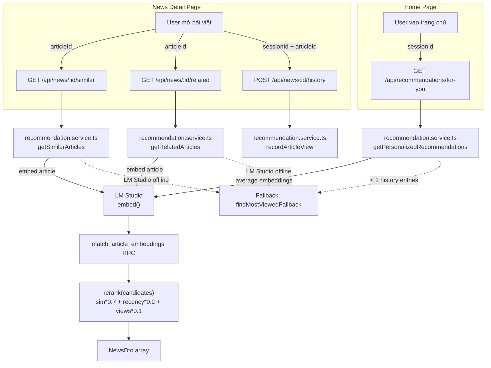

# Phase 8.3 — Recommendations

Ba loại gợi ý bài viết dựa trên embedding + lịch sử đọc ẩn danh.

---

## Mục tiêu

| Endpoint | Mô tả |
|----------|-------|
| `GET /api/news/:id/similar` | Bài cùng danh mục, semantic similarity cao nhất |
| `GET /api/news/:id/related` | Bài tất cả danh mục, semantic similarity cao nhất |
| `GET /api/recommendations/for-you` | Cá nhân hoá theo cookie session — fallback nếu chưa đủ lịch sử |
| `POST /api/news/:id/history` | Ghi nhận bài đã đọc cho session |

---

## Flow tổng quan



---

## Anonymous Session

User public không đăng nhập — session được track qua cookie.

**Composable:** `app/composables/useAnonymousSession.ts`

```typescript
// Tạo UUID lần đầu, lưu cookie 365 ngày
const sessionId = useCookie('session_id', { maxAge: 365 * 24 * 3600, sameSite: 'lax' })
if (!sessionId.value) sessionId.value = crypto.randomUUID()
```

Cookie được đọc ở cả SSR và client (SameSite=Lax, không cần HTTPS).

---

## Re-ranking Formula

Sau khi pgvector trả về candidates, service re-rank theo:

```
final_score = sim * 0.7 + recency * 0.2 + views * 0.1
```

| Component | Cách tính |
|-----------|-----------|
| `sim` | Cosine similarity từ pgvector (`[0, 1]`) |
| `recency` | Min-max normalised days since `publishedAt` (mới hơn = điểm cao hơn) |
| `views` | Min-max normalised `viewCount` trong candidate set |

---

## Similar Articles (`/api/news/:id/similar`)

- Load embedding của bài hiện tại từ `article_embeddings`
- Gọi `match_article_embeddings` với `category_id` filter (cùng danh mục)
- Loại bỏ bài hiện tại
- Re-rank, trả về tối đa 6 bài
- **Fallback:** nếu LM Studio offline hoặc bài chưa có embedding → `findMostViewedFallback` (cùng category)

## Related Articles (`/api/news/:id/related`)

- Load embedding của bài hiện tại
- Gọi `match_article_embeddings` không filter category
- Loại bỏ bài hiện tại
- Re-rank, trả về tối đa 6 bài
- **Fallback:** `findMostViewedFallback` (all categories)

## Personalized (`/api/recommendations/for-you`)

- Load 10 bài đọc gần nhất từ `user_article_history` theo `sessionId`
- Lấy embedding của từng bài từ `article_embeddings`
- Tính average vector (profile vector)
- Gọi `match_article_embeddings` loại trừ các bài đã đọc
- Re-rank
- **Fallback nếu < 2 entries:** trả về `findMostViewedFallback`

---

## Database: `user_article_history`

| Column | Type | Mô tả |
|--------|------|-------|
| `id` | uuid PK | |
| `anonymous_session_id` | text NOT NULL | Cookie session ID |
| `article_id` | uuid FK → news | |
| `viewed_at` | timestamptz | Default `now()` |

**Index:** `(anonymous_session_id, viewed_at DESC)` — query hiệu quả 10 bài mới nhất.

**RLS:**
- `anon`, `authenticated`: INSERT allowed
- `service_role`: full access
- Public SELECT: không cho phép (privacy)

**Migration:** `supabase/migrations/20260619200001_user_article_history.sql`

---

## API

### `GET /api/news/:id/similar`

| Param | Type | Mô tả |
|-------|------|-------|
| `id` | uuid (path) | Article ID (UUID) |

**Response 200:** `{ "data": NewsDto[] }` — tối đa 6 bài.

### `GET /api/news/:id/related`

Tương tự similar, không filter category.

### `GET /api/recommendations/for-you`

| Param | Type | Mô tả |
|-------|------|-------|
| `sessionId` | string (query) | Anonymous session ID từ cookie |

**Response 200:** `{ "data": NewsDto[] }`

### `POST /api/news/:id/history`

**Body:** `{ "sessionId": "uuid" }`

**Response 200:** `{ "data": null }` — luôn thành công, errors bị swallow (`console.warn`) để không block UX.

---

## Frontend

### Components

| Component | File | Mô tả |
|-----------|------|-------|
| `<SimilarArticles>` | `app/components/news/SimilarArticles.vue` | Section "Bài viết tương tự" — ẩn khi empty |
| `<RelatedArticles>` | `app/components/news/RelatedArticles.vue` | Section "Bài viết liên quan" — ẩn khi empty |
| `<PersonalizedArticles>` | `app/components/news/PersonalizedArticles.vue` | Section "Có thể bạn quan tâm" — ẩn khi empty |

### Composables

**`app/composables/news/useRecommendations.ts`**

Dùng `useAsyncData` (không phải `useFetch`) với guard pattern để tránh double-call khi `articleId` chưa ready:

```typescript
// Guard: nếu id chưa có → trả về empty, không gọi API
const { data } = useAsyncData(
  `similar-${id.value}`,
  async () => {
    if (!id.value) return EMPTY
    return $fetch(`/api/news/${id.value}/similar`)
  },
)
```

> ⚠️ `useFetch` với URL factory trả về `null` bị TypeScript reject (`null` không phải `NitroFetchRequest`). `useAsyncData` + guard là cách đúng.

### Tích hợp trong pages

**`app/pages/news/[slug].vue`**:
- `useSimilar(articleId)`, `useRelated(articleId)`
- Khi article load xong: gọi `POST /api/news/:id/history` với `sessionId`
- Mount `<SimilarArticles>` + `<RelatedArticles>` bên dưới content

**`app/pages/index.vue`**:
- `useAnonymousSession()` → `sessionId`
- `useForYou(sessionId)`
- Mount `<PersonalizedArticles>` cuối trang

---

## Files

```
supabase/migrations/
  20260619200001_user_article_history.sql

server/repositories/
  recommendation.repository.ts     ← findSimilarArticles, findRelatedArticles,
                                      findArticlesByIds, findMostViewedFallback,
                                      insertViewHistory, getRecentViewedEmbeddings

server/services/
  recommendation.service.ts        ← rerank, getSimilarArticles, getRelatedArticles,
                                      getPersonalizedRecommendations, recordArticleView

server/api/news/[id]/
  similar.get.ts
  related.get.ts
  history.post.ts

server/api/recommendations/
  for-you.get.ts

app/composables/
  useAnonymousSession.ts           ← UUID cookie generation/persistence
  news/useRecommendations.ts       ← useSimilar, useRelated, useForYou

app/components/news/
  SimilarArticles.vue
  RelatedArticles.vue
  PersonalizedArticles.vue
```
