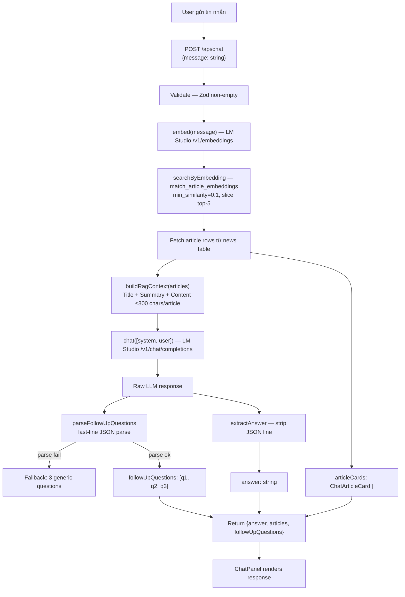

# Phase 8.4 — RAG Chatbot

Chatbot hỏi đáp grounded 100% vào kho bài viết. Mỗi câu hỏi được embed, tìm top-5 bài liên quan qua pgvector, xây context prompt, gọi LM Studio chat model, trả về answer + article cards + 3 câu hỏi gợi ý.

---

## Mục tiêu

- `POST /api/chat` — RAG pipeline đầy đủ
- Chat page tại `/chat`
- UI: `ChatPanel`, `ChatMessage`, `ChatArticleCard`, `FollowUpQuestions`
- Entry point trong navigation header (desktop + mobile)
- Return 503 khi LM Studio offline

---

## Flow



---

## System Prompt

```
You are a news assistant for Verdana News portal.
Answer ONLY using the provided article context.
Do NOT use any external knowledge or facts not present in the context.
Respond in the same language as the user's question (Vietnamese or English).
If the context does not contain sufficient information to answer the question,
clearly state that you don't have enough information from the available articles.

Article context:
<buildRagContext output>

---
IMPORTANT: At the very end of your response, on its own line, include exactly this JSON
object with 3 follow-up questions:
{"followUpQuestions": ["question 1", "question 2", "question 3"]}
The questions should be relevant to the answer and in the same language as the user's question.
```

---

## Context Builder (`rag-context.service.ts`)

Mỗi bài viết tạo ra một block:

```
Title: <title>
Summary: <summary nếu có>
Content: <strip HTML, cắt tối đa 800 ký tự>
```

Các block nối với nhau bằng `---`. Tổng context ≈ 5 × 800 = 4000 chars — phù hợp với context window của model nhỏ (4B params).

---

## Follow-up Questions Parsing

Server scan từ cuối response lên tìm dòng bắt đầu bằng `{`:

```typescript
// Tìm dòng cuối cùng dạng JSON
const line = rawResponse.split('\n').reverse().find(l => l.trim().startsWith('{'))
const { followUpQuestions } = JSON.parse(line)
```

**Fallback** nếu parse thất bại (model không follow format):
```
["Bạn muốn tìm hiểu thêm về chủ đề này?",
 "Có điều gì khác bạn muốn biết không?",
 "Bạn có muốn xem thêm bài viết liên quan không?"]
```

Request **không bao giờ fail** vì lỗi parse follow-up.

---

## API

### `POST /api/chat`

**Body:**
```json
{ "message": "AI có ứng dụng gì trong giáo dục?" }
```

**Response 200:**
```json
{
  "data": {
    "answer": "Theo các bài viết, AI được ứng dụng trong...",
    "articles": [
      {
        "title": "AI trong giáo dục hiện đại",
        "slug": "ai-trong-giao-duc-hien-dai",
        "thumbnailUrl": "https://...",
        "summary": "..."
      }
    ],
    "followUpQuestions": [
      "AI có thể thay thế giáo viên không?",
      "Các trường học nào đang dùng AI?",
      "Chi phí triển khai AI trong giáo dục là bao nhiêu?"
    ]
  }
}
```

**Response 503** (LM Studio offline):
```json
{
  "error": "AI_UNAVAILABLE",
  "message": "AI is temporarily unavailable. Please try again later."
}
```

**Response 400** (message rỗng):
```json
{
  "error": "VALIDATION_ERROR",
  "message": "message is required and must not be empty"
}
```

---

## Frontend

### Composable: `useRagChat`

```typescript
const { messages, pending, error, send, clear } = useRagChat()
```

| Property | Type | Mô tả |
|----------|------|-------|
| `messages` | `ChatMessage[]` | Array toàn bộ hội thoại |
| `pending` | `boolean` | Đang chờ response |
| `error` | `string \| null` | Error message user-friendly |
| `send(msg)` | function | Append user msg → POST → append assistant msg |
| `clear()` | function | Reset toàn bộ hội thoại |

**Error handling trong `send()`:**
- 503 → `"AI đang tạm thời không khả dụng. Vui lòng thử lại sau."`
- other → `"Có lỗi xảy ra. Vui lòng thử lại."`
- User message bị pop khỏi array khi có lỗi → user có thể retry

### Components

| Component | File | Mô tả |
|-----------|------|-------|
| `<ChatMessage>` | `app/components/chat/ChatMessage.vue` | Bubble tin nhắn — user: right navy, assistant: left slate |
| `<ChatArticleCard>` | `app/components/chat/ChatArticleCard.vue` | Card compact: thumbnail 64px + title + summary + link |
| `<FollowUpQuestions>` | `app/components/chat/FollowUpQuestions.vue` | 3 pill buttons, emit `select(question)` |
| `<ChatPanel>` | `app/components/chat/ChatPanel.vue` | Full interface — message list, input bar, typing dots, error banner, clear button |

### ChatPanel states

| State | UI |
|-------|----|
| Empty (no messages) | Icon + heading + 3 sample quick prompts |
| Pending | Typing indicator (3 bouncing dots) |
| Assistant response | Message bubble + article cards grid + follow-up pills |
| Error | Error banner trên input bar |

### `app/pages/chat.vue`

- Layout: `default` (public header/footer)
- Height: `h-[calc(100dvh-64px)]` — full viewport trừ header
- SEO: `useSeoMeta` với title/description/og

### Navigation Header

**Desktop:** Icon chat bubble (24px) trước nút "Đăng ký" — visible từ `xl` breakpoint.

**Mobile:** Link "Hỏi đáp tin tức" với icon trong mobile nav dropdown — sau danh sách categories, trước mobile search form.

---

## Design Decisions

| Decision | Lựa chọn | Lý do |
|----------|----------|-------|
| Stateless per-request | Mỗi POST là độc lập, không gửi conversation history | Model nhỏ có context window hạn chế; single-turn đủ cho POC |
| Top-5 retrieval | `match_count=5`, `min_similarity=0.1` | Đủ context, không overflow context window model |
| Article cards = retrieved (không generated) | Cards lấy từ pgvector result, không hỏi model | Tránh hallucinated slugs/titles |
| JSON follow-ups trong response text | Parse dòng cuối JSON, fallback nếu fail | Model nhỏ không support function calling; inline JSON đáng tin hơn |

---

## Files

```
server/services/
  rag-context.service.ts           ← buildRagContext(articles): HTML strip + 800 char cap
  rag-chat.service.ts              ← ragChat(event, message): full RAG pipeline

server/api/
  chat.post.ts                     ← POST /api/chat — Zod validate, call ragChat, 503 guard

app/composables/chat/
  useRagChat.ts                    ← messages, pending, error, send(), clear()

app/components/chat/
  ChatMessage.vue
  ChatArticleCard.vue
  FollowUpQuestions.vue
  ChatPanel.vue

app/pages/
  chat.vue                         ← /chat page

app/components/layout/
  LayoutHeader.vue                 ← Thêm chat icon (desktop) + chat link (mobile)
```
