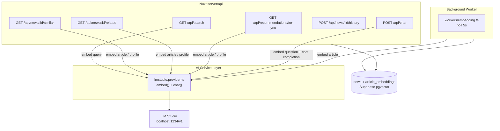

# Phase 8 — GenAI News Intelligence

Tổng quan Phase 8: thêm 3 tính năng AI vào news portal, tất cả chạy trên **LM Studio local** — không cần paid API.

---

## Mục tiêu

| Tính năng | Mô tả |
|-----------|-------|
| **Semantic Search** | Tìm kiếm bằng ngôn ngữ tự nhiên qua embedding |
| **Recommendations** | Gợi ý bài tương tự, liên quan, và cá nhân hoá |
| **RAG Chatbot** | Hỏi đáp grounded 100% vào kho bài viết |

---

## Tech Stack

| Layer | Technology |
|-------|-----------|
| Framework | Nuxt 4 · Vue 3 · TypeScript |
| Database | Supabase Postgres + `pgvector` |
| Vector search | `match_article_embeddings` RPC (cosine similarity) |
| Embedding model | LM Studio local — `gpustack/bge-m3-GGUF` (dim=**1024**) |
| Chat model | LM Studio local — bất kỳ chat model nào (e.g. `google/gemma-4-e2b`) |
| AI API contract | OpenAI-compatible `/v1/embeddings` + `/v1/chat/completions` |

---

## Kiến trúc tổng quan



---

## Sub-phases

| # | Phase | Docs | Status |
|---|-------|------|--------|
| 8.1 | Embedding Foundation | [01-embedding-foundation.md](./01-embedding-foundation.md) | ✅ Done |
| 8.2 | Semantic Search | [02-semantic-search.md](./02-semantic-search.md) | ✅ Done |
| 8.3 | Recommendations | [03-recommendations.md](./03-recommendations.md) | ✅ Done |
| 8.4 | RAG Chatbot | [04-rag-chatbot.md](./04-rag-chatbot.md) | ✅ Done |

---

## Environment Variables

```env
# LM Studio
LMSTUDIO_BASE_URL=http://localhost:1234/v1
LMSTUDIO_EMBEDDING_MODEL=gpustack/bge-m3-GGUF
LMSTUDIO_CHAT_MODEL=google/gemma-4-e2b

# Debug: log AI requests/responses to console
AI_DEBUG=true

# Embedding worker tuning (optional)
EMBEDDING_WORKER_POLL_MS=5000
EMBEDDING_WORKER_BATCH_SIZE=5
```

---

## Constraint quan trọng

### LM Studio là local-only

LM Studio chạy trên máy dev ở `http://localhost:1234`. Khi deploy lên cloud (Vercel), app không thể kết nối `localhost` của máy tính. Phase 8 là **local POC**. Để production thì thay `LMSTUDIO_BASE_URL` bằng cloud AI endpoint (cùng contract OpenAI-compatible).

### Embedding dimension phải cố định

Model `bge-m3-GGUF` → dim = **1024**. Thay model embedding sau khi đã generate embedding → phải:
1. Resize cột (`vector(N)`)
2. Truncate toàn bộ `article_embeddings`
3. Reset `embedding_jobs` về `pending` và chạy lại worker

### Frontend không được gọi LM Studio trực tiếp

```
Browser → Nuxt server/api → AI service → LM Studio
```

---

## Database tables thêm trong Phase 8

| Table | Migration | Mô tả |
|-------|-----------|-------|
| `article_embeddings` | `20260618000002_article_embeddings.sql` | 1024-dim vectors cho mỗi bài viết |
| `embedding_jobs` | `20260618000003_embedding_jobs.sql` | Job queue cho background embedding worker |
| `user_article_history` | `20260619200001_user_article_history.sql` | Lịch sử đọc bài theo anonymous session |

---

## Graceful Degradation

| Feature | Khi LM Studio offline |
|---------|----------------------|
| Semantic Search | Trả về **503** `AI_UNAVAILABLE` |
| Similar/Related | Fallback → **most-viewed** articles |
| For-You | Fallback → **most-viewed** articles |
| RAG Chatbot | Trả về **503** `AI_UNAVAILABLE` |
