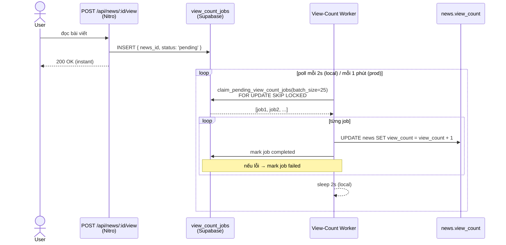
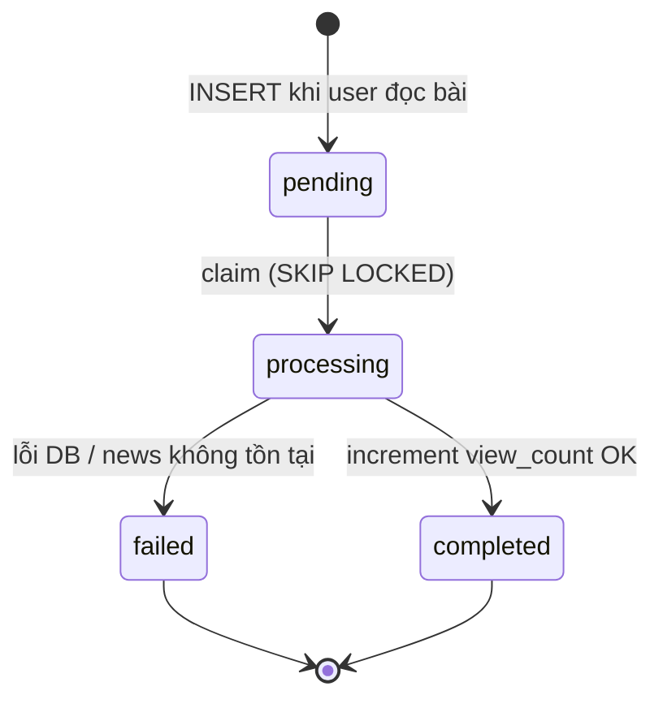

# Worker 1 — View-Count

Xử lý bất đồng bộ việc tăng `view_count` trên bảng `news` mỗi khi người dùng đọc một bài viết.

---

## Vì sao cần worker?

Tăng `view_count` trực tiếp trong request handler sẽ gây race condition nếu nhiều request đến cùng lúc cho cùng một bài. Thay vào đó, endpoint API chỉ **insert một job** vào hàng đợi (`view_count_jobs`); worker claim và xử lý theo batch — đảm bảo mỗi lượt xem được tính đúng một lần, không chặn request của user.

---

## Luồng xử lý



---

## State machine của job



---

## Database tables

### `view_count_jobs`

| Column | Type | Mô tả |
|--------|------|-------|
| `id` | uuid | PK |
| `news_id` | uuid | FK → `news.id` |
| `status` | enum | `pending` \| `processing` \| `completed` \| `failed` |
| `error_message` | text | Lỗi nếu failed |
| `created_at` | timestamptz | |
| `processed_at` | timestamptz | |

### RPC `claim_pending_view_count_jobs(batch_size)`

PostgreSQL function dùng `FOR UPDATE SKIP LOCKED` để đảm bảo không có 2 worker instance nào claim cùng một job — safe với concurrent invocations.

---

## Files liên quan

```
lib/background/view-count/
  service.ts        ← processPendingViewCountJobs(client, batchSize)
                       enqueueViewCountJob(client, newsId)
  repository.ts     ← insertViewCountJob()
                       claimPendingViewCountJobs()  ← gọi RPC
                       incrementNewsViewCount()
                       markViewCountJobCompleted()
                       markViewCountJobFailed()
  errors.ts         ← ViewCountJobError(code, message)

server/api/news/[id]/
  view.post.ts      ← enqueue job khi user POST view

server/api/internal/cron/
  view-count.post.ts ← Nitro handler (production only)
```

---

## Cách chạy

### Local dev

```bash
# Chạy riêng view-count worker
npx jiti workers/view-count.ts

# Hoặc chạy cả 3 worker cùng lúc
npm run worker:all
```

### Production (pg_cron)

`pg_cron` gọi HTTP POST mỗi phút:

```sql
-- supabase/migrations/20260526200000_setup_pg_cron_jobs.sql
select cron.schedule(
  'cron-view-count', '* * * * *',
  $$ select net.http_post(
    url => 'https://verdana-news.vercel.app/api/internal/cron/view-count',
    headers => jsonb_build_object('Authorization', 'Bearer ' || cron_secret)
  ) $$
);
```

---

## Environment variables

| Var | Default | Mô tả |
|-----|---------|-------|
| `VIEW_COUNT_WORKER_POLL_MS` | `2000` | Thời gian sleep giữa các tick (local) |
| `VIEW_COUNT_WORKER_BATCH_SIZE` | `25` | Số job tối đa mỗi tick |
| `CRON_SECRET` | — | Bearer token (production) |

---

## Monitoring

Admin dashboard (`/admin`) hiển thị live stats: `pending`, `processing`, `failed` từ API `/api/admin/worker-status`.
