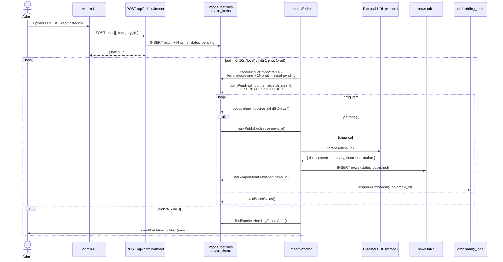
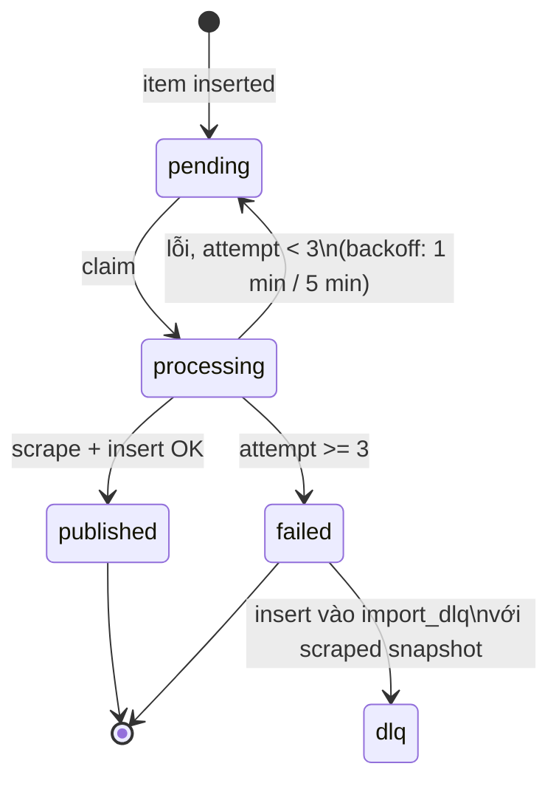
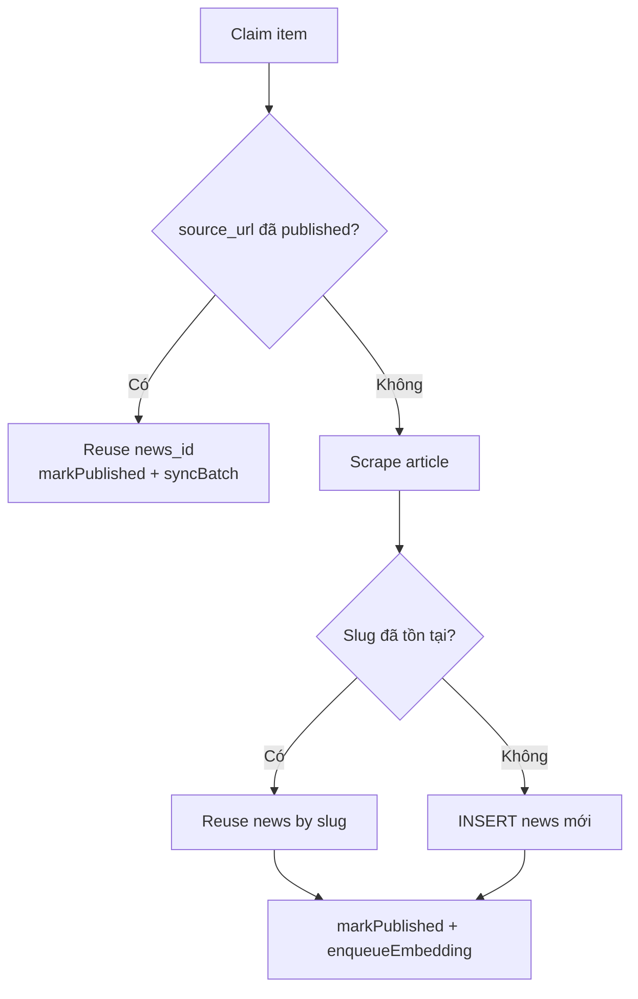

# Worker 2 — Import

Scrape bài viết từ URL bên ngoài, parse nội dung, publish vào bảng `news`, và enqueue embedding job cho bước tiếp theo.

---

## Tổng quan

Admin tạo một **import batch** gồm danh sách URL. Worker lần lượt scrape từng URL, tạo bài viết, và xử lý retry khi thất bại. Khi batch hoàn thành có bài thất bại, system gửi email alert.

---

## Luồng xử lý



---

## Retry logic



**Backoff schedule:**

| Attempt | Retry sau |
|---------|-----------|
| 1 | 1 phút |
| 2 | 5 phút |
| 3+ | Terminal fail → DLQ |

---

## Dedup logic

Import worker kiểm tra 2 tầng dedup để tránh bài bị duplicate:



---

## Stuck item recovery

Items bị kẹt ở trạng thái `processing` quá 10 phút (worker crash giữa chừng) sẽ được tự động reset về `pending` mỗi tick — đảm bảo không có item nào bị bỏ sót vĩnh viễn.

---

## Database tables

### `import_batches`

| Column | Type | Mô tả |
|--------|------|-------|
| `id` | uuid | PK |
| `category_id` | uuid | FK → `categories.id` |
| `status` | enum | `pending` \| `processing` \| `completed` \| `failed` \| `partial` |
| `total_items` | int | Tổng số URL |
| `failure_email_sent_at` | timestamptz | Đã gửi alert chưa |

### `import_items`

| Column | Type | Mô tả |
|--------|------|-------|
| `id` | uuid | PK |
| `batch_id` | uuid | FK → `import_batches.id` |
| `source_url` | text | URL cần scrape |
| `status` | enum | `pending` \| `processing` \| `published` \| `failed` |
| `attempt_count` | int | Số lần đã thử |
| `retry_after` | timestamptz | Không claim trước thời điểm này |
| `news_id` | uuid | FK → `news.id` sau khi published |
| `error_message` | text | Lỗi cuối |

### `import_dlq`

Dead-letter queue: lưu lại snapshot của những item thất bại hoàn toàn để admin có thể debug.

---

## Files liên quan

```
lib/background/import/
  service.ts     ← processImportItems()
                    recoverStuckImportItems()
                    processBatchAlerts()
                    ensureEmbeddingJob()
  repository.ts  ← claimPendingImportItems()
                    markImportItemPublished()
                    scheduleImportItemRetry()
                    markImportItemFailed()
                    insertImportDlqItem()
                    syncBatchStatus()
                    findBatchesNeedingFailureAlert()
  scraper.ts     ← scrapeArticle(url) → { title, content, ... }
                    generateSlug(title)
  crawler.ts     ← fetchHtml(url) + parseContent()
  alert.ts       ← sendBatchFailureAlert(batch, failedItems)

server/api/internal/cron/
  import.post.ts  ← Nitro handler (production only)
```

---

## Cách chạy

### Local dev

```bash
# Chạy riêng import worker
npx jiti workers/import.ts

# Hoặc chạy cả 3 worker cùng lúc
npm run worker:all
```

### Production (pg_cron)

```sql
-- supabase/migrations/20260526200000_setup_pg_cron_jobs.sql
select cron.schedule(
  'cron-import', '* * * * *',
  $$ select net.http_post(
    url => 'https://verdana-news.vercel.app/api/internal/cron/import',
    headers => jsonb_build_object('Authorization', 'Bearer ' || cron_secret)
  ) $$
);
```

---

## Environment variables

| Var | Default | Mô tả |
|-----|---------|-------|
| `IMPORT_WORKER_POLL_MS` | `10000` | Sleep giữa các tick (local) |
| `IMPORT_WORKER_BATCH_SIZE` | `5` | Items tối đa mỗi tick |
| `IMPORT_WORKER_ALERT_INTERVAL_TICKS` | `6` | Kiểm tra alert mỗi N tick |
| `CRON_SECRET` | — | Bearer token (production) |

---

## Side effect quan trọng

Sau khi publish thành công, import worker **tự động enqueue embedding job** cho bài vừa tạo:

```
Import Worker → INSERT embedding_jobs { article_id, status: 'pending' }
                          ↓
              Embedding Worker sẽ pick up ở tick tiếp theo
```

Điều này đảm bảo mọi bài được import đều có vector embedding cho semantic search và recommendations.
