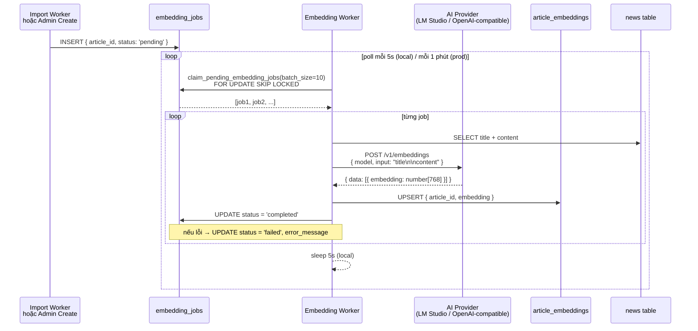
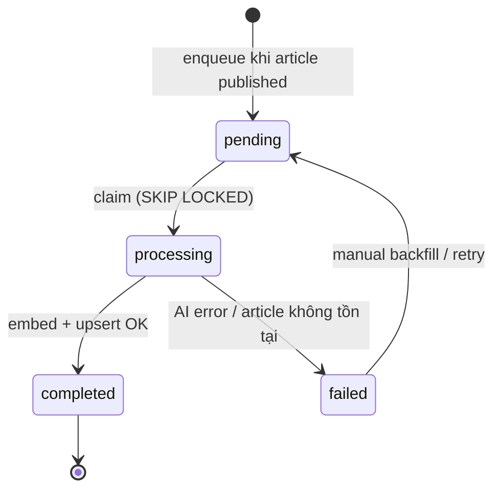
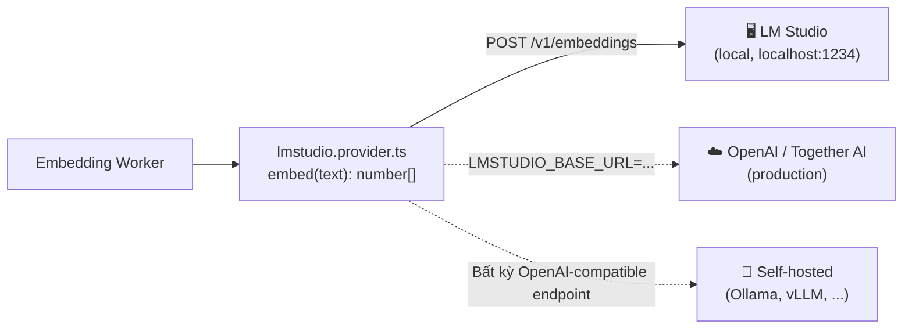

# Worker 3 — Embedding

Generate vector embedding (1024 chiều) cho từng bài viết bằng LM Studio (local) hoặc bất kỳ OpenAI-compatible API nào (production). Kết quả lưu vào `article_embeddings` để phục vụ semantic search và recommendations.

---

## Tổng quan

Mỗi bài viết được publish (qua import hoặc admin create) sẽ có một `embedding_jobs` record ở trạng thái `pending`. Worker batch-claim các job này, gọi AI API để tạo vector, lưu vào `article_embeddings`, rồi mark job completed.

---

## Luồng xử lý



---

## State machine của embedding job



> **Note:** Failed jobs không tự retry. Dùng backfill script để re-enqueue nếu cần.

---

## AI Provider — OpenAI-compatible

Worker dùng cùng một HTTP contract cho mọi provider:



Chỉ cần đổi 2 env vars để switch provider — **không cần sửa code**:

| Provider | `LMSTUDIO_BASE_URL` | `LMSTUDIO_EMBEDDING_MODEL` | Dim |
|----------|--------------------|-----------------------------|-----|
| LM Studio (local) — **current** | `http://localhost:1234` | `gpustack/bge-m3-GGUF` | 1024 |
| OpenAI | `https://api.openai.com` | `text-embedding-3-small` | 1536 |
| Together AI | `https://api.together.xyz` | `togethercomputer/m2-bert-80M-8k-retrieval` | 768 |
| Ollama (self-host) | `http://your-server:11434/v1` | `nomic-embed-text` | 768 |

> ⚠️ **Đổi model = đổi dimension** → cần migration SQL để resize `vector(N)` column, truncate embeddings cũ, reset tất cả jobs về `pending`. Xem `supabase/migrations/20260619100000_resize_embedding_vector_1024.sql`.

---

## Input text format

```
Title: {title}
Summary: {summary}
Description: {content_first_2000_chars}
Category: {category_name}
```

Content được strip HTML trước khi gửi và truncate ở **2000 ký tự** để cân bằng giữa coverage và token budget. Các field null/empty bị bỏ qua.

See `server/services/embedding.service.ts` → `buildEmbeddingText()`.

---

## Database tables

### `embedding_jobs`

| Column | Type | Mô tả |
|--------|------|-------|
| `id` | uuid | PK |
| `article_id` | uuid | FK → `news.id` |
| `status` | enum | `pending` \| `processing` \| `completed` \| `failed` |
| `error_message` | text | Lỗi nếu failed |
| `created_at` | timestamptz | |
| `processed_at` | timestamptz | |

### `article_embeddings`

| Column | Type | Mô tả |
|--------|------|-------|
| `article_id` | uuid | PK, FK → `news.id` |
| `embedding` | `vector(1024)` | pgvector — 1024 chiều (BGE-M3) |
| `created_at` | timestamptz | |
| `updated_at` | timestamptz | |

### RPC `claim_pending_embedding_jobs(batch_size)`

Dùng `FOR UPDATE SKIP LOCKED` — safe với concurrent invocations từ nhiều cron trigger.

---

## Files liên quan

```
lib/background/embedding/
  service.ts                    ← processPendingEmbeddingJobs(client, batchSize)

server/services/
  embedding.service.ts          ← generateAndSaveEmbedding(client, articleId)
  ai/
    lmstudio.provider.ts        ← embed(text): Promise<number[]>
                                   chat(messages): Promise<string>

server/repositories/
  embedding-job.repository.ts   ← claimPendingEmbeddingJobs()
                                   enqueueEmbeddingJob()
                                   completeJob()
                                   failJob()

server/services/
  embedding-backfill.service.ts ← selectArticleIdsToEnqueue()

server/api/internal/cron/
  embedding.post.ts             ← Nitro handler (production only)

supabase/migrations/
  20260619000001_add_embedding_cron_job.sql ← pg_cron job
```

---

## Cách chạy

### Local dev

```bash
# Yêu cầu: LM Studio đang chạy với model đã load
# Set trong .env:
# LMSTUDIO_BASE_URL=http://localhost:1234
# LMSTUDIO_EMBEDDING_MODEL=text-embedding-nomic-embed-text-v1.5

# Chạy riêng embedding worker
npm run worker:embedding

# Hoặc chạy cả 3 worker cùng lúc
npm run worker:all
```

### Backfill & Model switch (manual)

Khi có bài viết chưa có embedding, hoặc sau khi đổi model:

```bash
# 1. Reset tất cả jobs về pending (Supabase SQL Editor)
UPDATE public.embedding_jobs
SET status = 'pending', attempt_count = 0,
    started_at = NULL, finished_at = NULL, last_error = NULL
WHERE status = 'completed';

# 2. Chạy worker để re-embed
npm run worker:embedding

# 3. Theo dõi tiến trình
npm run embeddings:watch
```

### Production (pg_cron)

```sql
-- supabase/migrations/20260619000001_add_embedding_cron_job.sql
select cron.schedule(
  'cron-embedding', '* * * * *',
  $$ select net.http_post(
    url => 'https://verdana-news.vercel.app/api/internal/cron/embedding',
    headers => jsonb_build_object('Authorization', 'Bearer ' || cron_secret)
  ) $$
);
```

---

## Environment variables

| Var | Default | Mô tả |
|-----|---------|-------|
| `EMBEDDING_WORKER_POLL_MS` | `5000` | Sleep giữa các tick (local) |
| `EMBEDDING_WORKER_BATCH_SIZE` | `10` | Jobs tối đa mỗi tick |
| `LMSTUDIO_BASE_URL` | — | **Required.** URL của AI provider |
| `LMSTUDIO_EMBEDDING_MODEL` | — | **Required.** Model identifier |
| `CRON_SECRET` | — | Bearer token (production) |

---

## Production considerations

LM Studio chỉ chạy được local. Khi deploy lên Vercel, cần một trong các options:

| Option | Cách làm | Chi phí ước tính |
|--------|----------|-----------------|
| **OpenAI** (recommended) | `LMSTUDIO_BASE_URL=https://api.openai.com` | ~$0.02 / 1M tokens |
| **Together AI** | `LMSTUDIO_BASE_URL=https://api.together.xyz` | Free tier có |
| **VPS self-hosted** | Deploy Ollama + expose qua nginx | Chi phí server |

Không cần thay đổi code — chỉ đổi env vars.

---

## Monitoring

### CLI (local dev)

```bash
# Snapshot một lần
npm run embeddings:check

# Watch mode — refresh mỗi 5s
npm run embeddings:watch
```

Output mẫu:
```
═══════════════════════════════════
  Embedding Monitor
═══════════════════════════════════
  Published articles : 323
  Total embeddings   : 323
  Coverage           : [████████████████████] 100%

  Model Distribution:
    323 → gpustack/bge-m3-GGUF

  Job Queue:
    completed : 323
```

Script: `scripts/check-embeddings.ts`

### Debug API

`GET /api/internal/debug/embeddings` trả về coverage stats, model distribution, và job queue status dạng JSON.

### Admin dashboard

`/admin` hiển thị live embedding queue stats (poll mỗi 5s từ `/api/admin/worker-status`).
