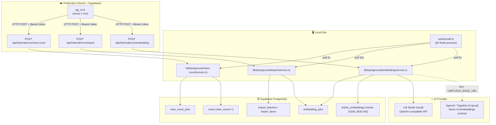

# Background Workers — Architecture Overview

Hệ thống background worker xử lý 3 loại job bất đồng bộ: view-count, import bài viết, và tạo embedding AI.

---

## Tổng quan kiến trúc



---

## Hai chế độ chạy

| | Local Dev | Production |
|--|-----------|------------|
| **Entry point** | `npm run worker:all` → `workers/all.ts` | `pg_cron` HTTP trigger |
| **Process** | Node.js process riêng, chạy song song với `npm run dev` | Serverless — Nitro function invocation |
| **Nitro có liên quan không?** | Không. Worker gọi `lib/background/*` trực tiếp | Có. pg_cron gọi `/api/internal/cron/*` Nitro routes |
| **Supabase client** | `createClient()` với service role key từ `.env` | `serverSupabaseServiceRole(event)` từ Nuxt Supabase |
| **Bảo mật** | Không cần (localhost) | `CRON_SECRET` Bearer token |
| **Poll interval** | Configurable qua env vars | pg_cron schedule (`* * * * *`) |

---

## File structure

```
workers/
  all.ts                          ← Entry point: 3 concurrent loops (local only)
  view-count.ts                   ← Standalone view-count runner
  import.ts                       ← Standalone import runner

lib/background/
  view-count/
    service.ts                    ← processPendingViewCountJobs()
    repository.ts                 ← claim, complete, fail jobs
    errors.ts                     ← ViewCountJobError

  import/
    service.ts                    ← processImportItems(), recoverStuckImportItems()
    repository.ts                 ← claim, publish, retry, DLQ, batch sync
    scraper.ts                    ← scrapeArticle(), generateSlug()
    crawler.ts                    ← HTTP fetch + HTML parse
    alert.ts                      ← sendBatchFailureAlert() via email

  embedding/
    service.ts                    ← processPendingEmbeddingJobs()

server/api/internal/cron/
  view-count.post.ts              ← POST /api/internal/cron/view-count
  import.post.ts                  ← POST /api/internal/cron/import
  embedding.post.ts               ← POST /api/internal/cron/embedding

server/services/ai/
  lmstudio.provider.ts            ← OpenAI-compatible embed() + chat()

server/services/
  recommendation.service.ts       ← getSimilarArticles, getRelatedArticles, getPersonalizedRecommendations
  rag-context.service.ts          ← buildRagContext(articles): HTML strip + 800-char truncation per article
  rag-chat.service.ts             ← ragChat(event, message): embed → pgvector → context → LM Studio chat

server/repositories/
  embedding-job.repository.ts     ← claimPendingEmbeddingJobs(), enqueueEmbeddingJob()
  recommendation.repository.ts    ← findSimilarArticles, findRelatedArticles, insertViewHistory, getRecentViewedEmbeddings

supabase/migrations/
  20260526200000_setup_pg_cron_jobs.sql   ← pg_cron: view-count + import
  20260619000001_add_embedding_cron_job.sql ← pg_cron: embedding
```

---

## Các Worker

| # | Worker | Docs |
|---|--------|------|
| 1 | View-Count | [01-view-count-worker.md](./01-view-count-worker.md) |
| 2 | Import | [02-import-worker.md](./02-import-worker.md) |
| 3 | Embedding | [03-embedding-worker.md](./03-embedding-worker.md) |

---

## Environment variables chung

| Var | Dùng bởi | Mô tả |
|-----|----------|-------|
| `SUPABASE_URL` | tất cả (local) | Supabase project URL |
| `SUPABASE_SERVICE_KEY` | tất cả (local) | Service role key (bypass RLS) |
| `CRON_SECRET` | tất cả (prod) | Bearer token pg_cron → Nitro |
| `LMSTUDIO_BASE_URL` | embedding worker, search, recommendations, chat | LM Studio OpenAI-compatible endpoint (e.g. `http://localhost:1234/v1`) |
| `LMSTUDIO_EMBEDDING_MODEL` | embedding worker, search, recommendations, chat | Model ID for embeddings (e.g. `gpustack/bge-m3-GGUF`) |
| `LMSTUDIO_CHAT_MODEL` | RAG chatbot | Model ID for chat completions |

---

## Phase 8 — GenAI Features

Ngoài 3 background workers, Phase 8 thêm 3 GenAI feature chạy on-demand qua `server/api`:

| Feature | Endpoint | Mô tả |
|---------|----------|-------|
| **Semantic Search** | `GET /api/search` | Embed query → pgvector cosine similarity → ranked articles |
| **Recommendations** | `GET /api/news/:id/similar` | Embed article → same-category vector search → rerank |
| | `GET /api/news/:id/related` | Embed article → all-category vector search → rerank |
| | `GET /api/recommendations/for-you` | Average viewed embeddings → personalized vector search |
| | `POST /api/news/:id/history` | Record anonymous session view (cookie-based) |
| **RAG Chatbot** | `POST /api/chat` | Embed question → retrieve top-5 articles → LM Studio chat with grounding prompt → answer + article cards + 3 follow-up questions |

Tất cả AI feature đều có **graceful fallback**: nếu LM Studio không chạy, search trả về 503, recommendations trả về most-viewed, chat trả về 503 với `AI_UNAVAILABLE`.

Xem chi tiết: [phase-8-lmstudio-genai-plan.md](../../phase-8-lmstudio-genai-plan.md)
