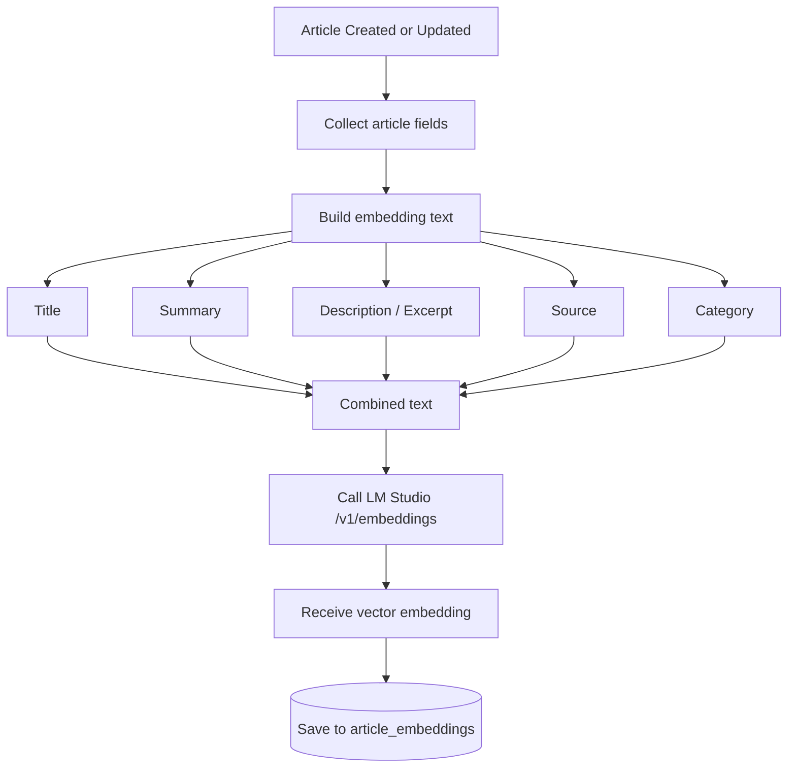
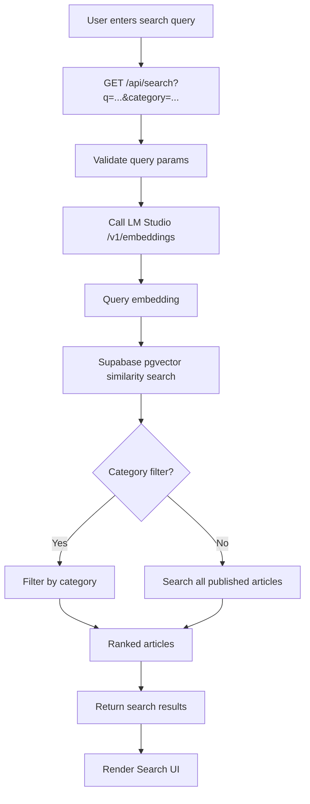
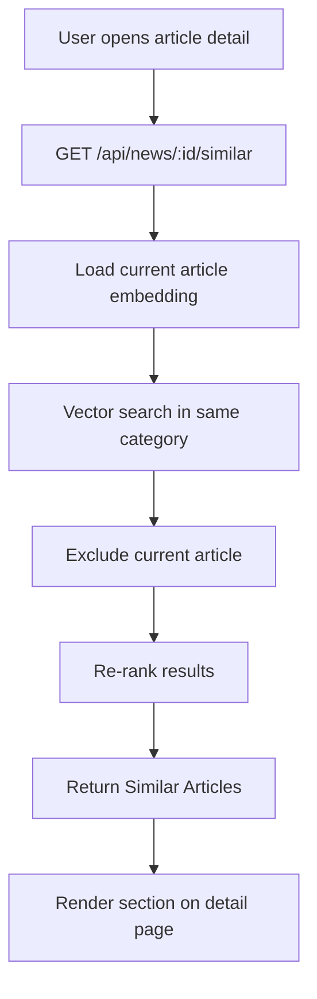
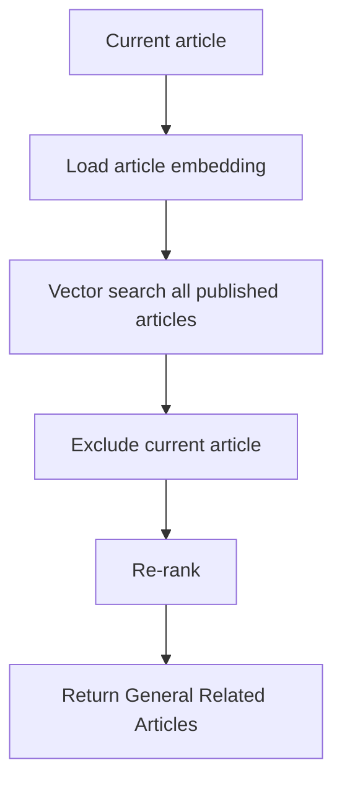
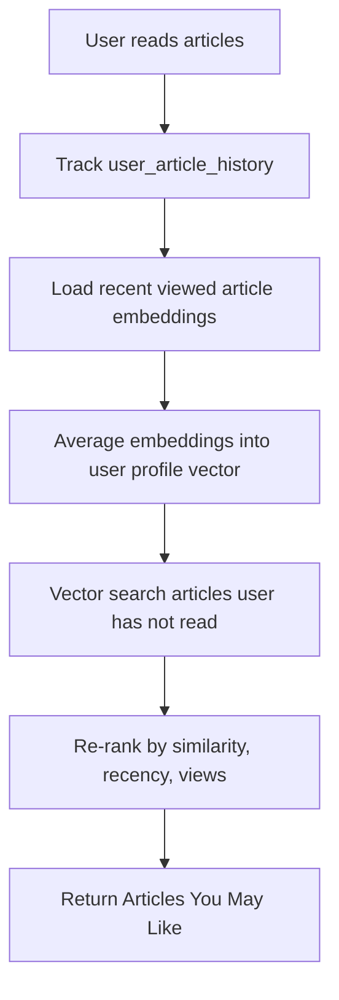
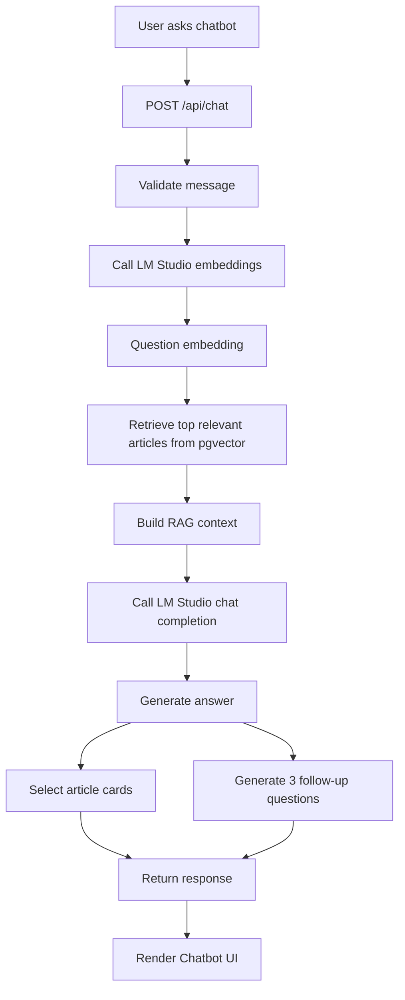
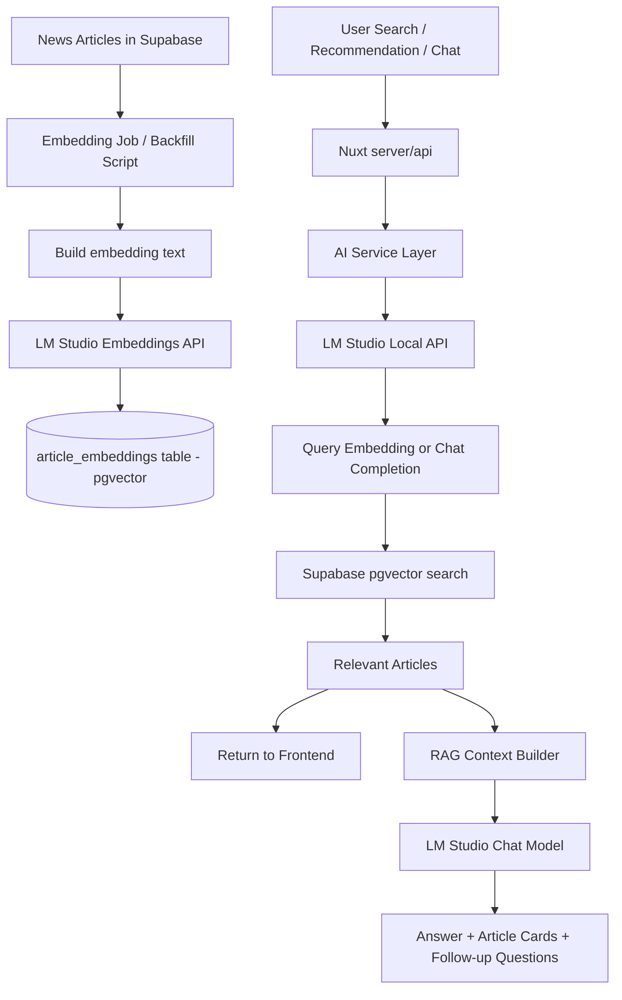

# Phase 8 — GenAI News Intelligence POC

## Final Decision

Phase 8 adds GenAI features to the existing Nuxt news portal using the current stack and **LM Studio local only** as the AI runtime.

No paid LLM runtime is required for this phase.

```text
Use:
- Nuxt 4
- Vue 3
- TypeScript
- Tailwind CSS
- Nuxt server/api
- Supabase Postgres
- Supabase pgvector
- LM Studio local API

Do not use:
- OpenAI API
- Gemini API
- Vertex AI
- LangChain
- Paid LLM providers
```

The project remains a **local-first POC**. LM Studio runs locally and exposes an OpenAI-compatible API used by the Nuxt server.

---

## Goal

Build three GenAI features on top of the existing news portal:

1. **Semantic Search**
2. **Recommendation System**
3. **RAG Chatbot**

These features use article embeddings stored in Supabase pgvector and generated by LM Studio.

---

## Final Tech Stack

### Frontend

- Nuxt 4
- Vue 3
- TypeScript
- Tailwind CSS

### Backend

- Nuxt `server/api`
- Existing service/repository architecture

### Database

- Supabase Postgres

### Vector Search

- Supabase `pgvector`

### AI Runtime

- LM Studio local

### Embeddings

- LM Studio local embedding model

### Chatbot LLM

- LM Studio local chat model

### API Compatibility

- LM Studio OpenAI-compatible local API

### Development Tools

- ChatGPT / Codex can be used to help write code, specs, prompts, and presentation material.
- They are **not runtime dependencies** of the app.

---

## Environment Variables

```env
AI_PROVIDER=lmstudio
EMBEDDING_PROVIDER=lmstudio

LMSTUDIO_BASE_URL=http://localhost:1234/v1
LMSTUDIO_CHAT_MODEL=
LMSTUDIO_EMBEDDING_MODEL=

AI_DEBUG=true
```

---

## Important Constraints

### LM Studio is local-only

```text
Local app -> can call http://localhost:1234/v1
Cloud-deployed app -> cannot call your laptop's localhost
```

This means Phase 8 is intended for:

```text
local development
local demo
POC validation
```

A future deployed version can replace LM Studio with a cloud provider through the same AI adapter pattern.

### Embedding dimension must be fixed

The selected LM Studio embedding model has a fixed vector dimension.

Example:

```text
embedding dimension = 768
```

Then the pgvector column must match:

```sql
embedding vector(768)
```

Do not change the embedding model after generating embeddings unless all existing embeddings are rebuilt.

### Frontend must not call LM Studio directly

Correct flow:

```text
Frontend
  -> Nuxt server/api
  -> AI service
  -> LM Studio local API
```

Do not expose LM Studio calls directly from browser code.

---

# Phase Breakdown

Phase 8 is split into four implementation phases:

```text
Phase 8.1 — Embedding Foundation
Phase 8.2 — Semantic Search
Phase 8.3 — Recommendations
Phase 8.4 — RAG Chatbot
```

---

# Phase 8.1 — Embedding Foundation

## Goal

Create the foundation for semantic search, recommendations, and RAG by generating embeddings for all published articles.

## Flow



## Embedding Text Format

Each article embedding should be generated from a combined text payload:

```text
Title: ...
Summary: ...
Description: ...
Source: ...
Category: ...
```

## Database

Create table:

```text
article_embeddings
```

Recommended fields:

```text
id
article_id
embedding
embedding_text
embedding_model
created_at
updated_at
```

## Tasks

```text
[ ] Enable pgvector in Supabase
[ ] Create article_embeddings table
[ ] Add vector similarity SQL/RPC function
[ ] Add LM Studio config env
[ ] Add AI provider service for LM Studio
[ ] Add embedding.service.ts
[ ] Generate embedding text from article fields
[ ] Add backfill script/API for existing published articles
[ ] Generate embeddings when article is created/updated
```

## Suggested Files

```text
server/services/ai/lmstudio.provider.ts
server/services/embedding.service.ts
server/repositories/article-embedding.repository.ts
server/api/admin/embeddings/backfill.post.ts
supabase/migrations/*_article_embeddings.sql
```

---

# Phase 8.2 — Semantic Search

## Goal

Allow users to search articles using natural language queries.

Search across:

```text
title
summary
description
source
```

Support filtering by:

```text
category
```

## Flow



## API

```text
GET /api/search?q=ai education&category=technology
```

## Response Shape

```ts
{
  data: [
    {
      id: string
      title: string
      slug: string
      summary: string
      thumbnailUrl: string | null
      category: string
      source: string | null
      score: number
    }
  ]
}
```

## Tasks

```text
[ ] Add search repository using pgvector
[ ] Add semantic-search.service.ts
[ ] Add GET /api/search
[ ] Support q param
[ ] Support category filter
[ ] Return article cards with similarity score
[ ] Add search page or header search UI
[ ] Add loading/empty/error states
```

## Suggested Files

```text
server/api/search.get.ts
server/services/semantic-search.service.ts
server/repositories/search.repository.ts
app/pages/search.vue
app/composables/search/useSemanticSearch.ts
```

---

# Phase 8.3 — Recommendations

## Goal

Add recommendation sections powered by article embeddings and user reading history.

There are three recommendation types:

1. Similar Articles
2. General Related Articles
3. Personalized Recommendations

---

## 8.3.1 Similar Articles

Similar Articles are shown on the article detail page.

Rules:

```text
- Same category
- Semantic similarity
- Exclude current article
- Apply lightweight re-ranking
```

## Flow



---

## 8.3.2 General Related Articles

Related Articles are not restricted to the same category.

Rules:

```text
- All published articles
- Semantic similarity
- Exclude current article
- Apply lightweight re-ranking
```

## Flow



---

## 8.3.3 Personalized Recommendations

Personalized recommendations are based on user reading history.

MVP rule:

```text
user profile embedding = average embeddings of recently viewed articles
```

If the user has no history:

```text
fallback = latest / trending / most viewed articles
```

## Flow



## Database

Create table:

```text
user_article_history
```

Recommended fields:

```text
id
user_id nullable
anonymous_session_id nullable
article_id
viewed_at
```

## APIs

```text
GET /api/news/:id/similar
GET /api/news/:id/related
GET /api/recommendations/for-you
POST /api/news/:id/history
```

## Re-ranking Rule

Use a lightweight scoring model:

```text
final_score =
  semantic_similarity
  + recency_boost
  + view_count_boost
```

## Tasks

```text
[ ] Track user article history when detail page is visited
[ ] Add user_article_history table
[ ] Add similar article endpoint
[ ] Add general related article endpoint
[ ] Add personalized recommendation endpoint
[ ] Add re-ranking logic
[ ] Add UI sections:
    - Similar Articles
    - Related Articles
    - Articles You May Like
```

## Suggested Files

```text
server/services/recommendation.service.ts
server/repositories/recommendation.repository.ts
server/api/news/[id]/similar.get.ts
server/api/news/[id]/related.get.ts
server/api/recommendations/for-you.get.ts
app/components/news/SimilarArticles.vue
app/components/news/RelatedArticles.vue
app/components/news/PersonalizedArticles.vue
```

---

# Phase 8.4 — RAG Chatbot

## Goal

Create a chatbot that uses all published articles as its knowledge base.

The chatbot must:

```text
- Answer user questions
- Recommend or display relevant articles
- Return article cards with title + thumbnail
- Always suggest 3 follow-up questions after each answer
```

## Flow



## API

```text
POST /api/chat
```

## Request

```json
{
  "message": "What articles do we have about AI?"
}
```

## Response

```ts
{
  answer: string
  articles: [
    {
      title: string
      slug: string
      thumbnailUrl: string | null
      summary: string
    }
  ],
  followUpQuestions: [string, string, string]
}
```

## Chatbot Prompt Rule

The chatbot must follow this rule:

```text
Answer using only the provided article context.
If the context is insufficient, say that the available articles do not contain enough information.
Always include 3 follow-up questions.
```

## Tasks

```text
[ ] Add RAG retrieval service
[ ] Add context builder
[ ] Add LM Studio chat completion provider
[ ] Add POST /api/chat
[ ] Ensure chatbot answers only from retrieved articles
[ ] Return article cards
[ ] Always return 3 follow-up questions
[ ] Add chatbot UI
[ ] Add empty/error/loading states
```

## Suggested Files

```text
server/api/chat.post.ts
server/services/rag-chat.service.ts
server/services/rag-context.service.ts
app/pages/chat.vue
app/components/chat/ChatPanel.vue
app/components/chat/ChatMessage.vue
app/components/chat/ChatArticleCard.vue
app/components/chat/FollowUpQuestions.vue
app/composables/chat/useRagChat.ts
```

---

# Overall Architecture



---

# Implementation Order

## Step 1 — Embedding Foundation

```text
1. Enable pgvector
2. Create article_embeddings table
3. Add LM Studio provider
4. Add embedding service
5. Backfill existing article embeddings
6. Upsert embeddings on article create/update
```

## Step 2 — Semantic Search

```text
1. Add vector search RPC/repository
2. Add GET /api/search
3. Add category filter
4. Add search UI
5. Add loading/empty/error states
```

## Step 3 — Recommendations

```text
1. Track reading history
2. Add similar article endpoint
3. Add related article endpoint
4. Add personalized recommendations endpoint
5. Add recommendation UI sections
```

## Step 4 — RAG Chatbot

```text
1. Add RAG retrieval service
2. Add chat completion call to LM Studio
3. Add POST /api/chat
4. Return answer + article cards + 3 follow-up questions
5. Add chatbot UI
```

---

# Demo Plan

## Demo 1 — Semantic Search

Search query:

```text
AI in education
```

Show:

```text
- Natural language query
- Category filter
- Relevant article cards
```

## Demo 2 — Similar / Related Articles

Open an article detail page.

Show:

```text
- Similar Articles: same category
- Related Articles: across all categories
```

## Demo 3 — Personalized Recommendations

Read a few articles.

Then show:

```text
Articles You May Like
```

Explain:

```text
Recommendations are based on user reading history embeddings.
```

## Demo 4 — RAG Chatbot

Ask:

```text
What articles do we have about AI?
```

Show:

```text
- Answer generated from retrieved article context
- Article cards with title + thumbnail
- 3 follow-up questions
```

---

# Codex Prompt — Phase 8.1

Use this prompt to implement the first step.

```text
Implement Phase 8.1 — Embedding Foundation using LM Studio only.

Context:
- Nuxt 4 + Vue 3 + TypeScript
- Supabase Postgres
- Use Supabase pgvector for vector storage/search
- Use existing server/api -> service -> repository architecture
- Use LM Studio local OpenAI-compatible API for embeddings
- Do not use OpenAI API, Gemini, Vertex AI, LangChain, or paid LLM providers
- Do not implement search UI or chatbot yet

Requirements:
1. Add pgvector migration.
2. Add article_embeddings table.
3. Add SQL/RPC function for vector similarity search.
4. Add LM Studio provider config using:
   LMSTUDIO_BASE_URL
   LMSTUDIO_EMBEDDING_MODEL
5. Add embedding service that builds embedding text from:
   title, summary, description/excerpt, source, category
6. Add repository to upsert article embeddings.
7. Add admin/backfill API or script to generate embeddings for existing published articles.
8. Store embedding_text and embedding_model.
9. Keep embedding dimension consistent with the selected LM Studio embedding model.
10. Run npm run lint and npm run typecheck.

Acceptance:
- Existing published articles can be backfilled with embeddings.
- article_embeddings contains one vector per article.
- No paid AI provider is used.
- Existing app flows remain unchanged.
```

---

# Final Summary

```text
Phase 8 uses LM Studio local as the only AI runtime.
Supabase pgvector is the vector database.
Nuxt server/api is the integration layer.
The implementation is split into:
1. Embedding Foundation
2. Semantic Search
3. Recommendations
4. RAG Chatbot
```
